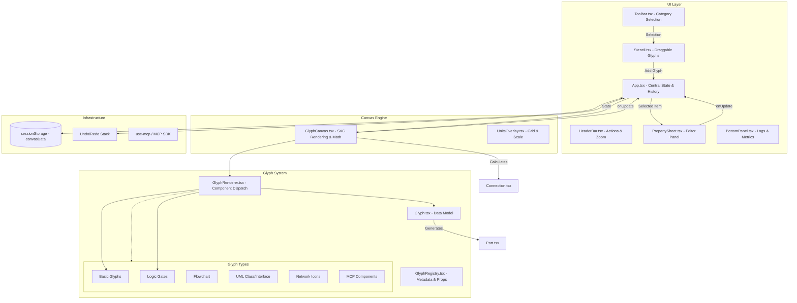

# R_js_draw

A React-based diagramming application built with **Vite** and **TypeScript** 5.8. Allows users to create, connect, and customize "Glyphs" (SVG-based components) on a persistent canvas.

## Architecture Overview



## Key Project Facts

- **State Management**: Centralized in [src/App.tsx](src/App.tsx). Uses `Page` objects to support multiple canvas tabs. History (Undo/Redo) is manually tracked in a `history` stack.
- **Persistence**: Application state is automatically persisted to `sessionStorage` under the key `canvasData`.
- **Glyph System**: 
  - **Model**: Defined by the `Glyph` class in [src/glyph/Glyph.tsx](src/glyph/Glyph.tsx).
  - **Rendering**: Dispatched via [src/glyph/GlyphRenderer.tsx](src/glyph/GlyphRenderer.tsx) based on `glyph.type`.
  - **Registry**: [src/glyph/type/GlyphRegistry.tsx](src/glyph/type/GlyphRegistry.tsx) maps glyph types to metadata and custom Property Sheet components.
- **Canvas Engine**: [src/GlyphCanvas.tsx](src/GlyphCanvas.tsx) handles SVG rendering, coordinate normalization (Zoom/Pan), and connection line calculations (Bezier/Manhattan/Line).
- **Technology Stack**: React 19, Vite, TypeScript, and **Model Context Protocol (MCP)** integration via `use-mcp`.

## Getting Started

```bash
npm install
npm run dev
```

