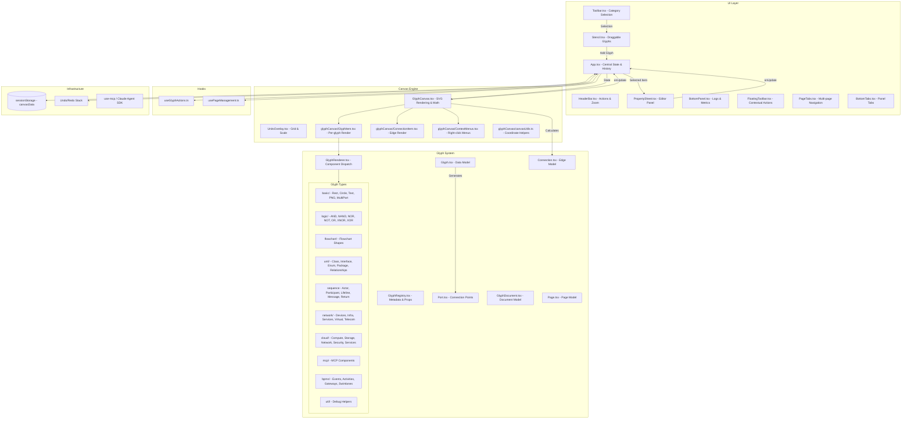

# R_js_draw

A React-based diagramming application built with **Vite** and **TypeScript** 5.8. Allows users to create, connect, and customize "Glyphs" (SVG-based components) on a persistent canvas.

## Technology Stack

| Layer | Technology |
|-------|-----------|
| UI Framework | React 19 |
| Build Tool | Vite 7 |
| Language | TypeScript 5.8 |
| Rendering | SVG |
| Testing | Vitest 3 + Testing Library |
| MCP Integration | `use-mcp`, `@anthropic-ai/claude-agent-sdk` |
| Containerization | Docker (nginx:1.27-alpine) |

## Architecture Overview


```mermaid
graph TD
    subgraph UI_Layer [UI Layer]
        App[App.tsx - Central State & History]
        Toolbar[Toolbar.tsx - Category Selection]
        Stencil[Stencil.tsx - Draggable Glyphs]
        HeaderBar[HeaderBar.tsx - Actions & Zoom]
        PropertySheet[PropertySheet.tsx - Editor Panel]
        BottomPanel[BottomPanel.tsx - Logs & Metrics]
        FloatingToolbar[FloatingToolbar.tsx - Contextual Actions]
        PageTabs[PageTabs.tsx - Multi-page Navigation]
        BottomTabs[BottomTabs.tsx - Panel Tabs]
    end

    subgraph Canvas_Engine [Canvas Engine]
        GlyphCanvas[GlyphCanvas.tsx - SVG Rendering & Math]
        UnitsOverlay[UnitsOverlay.tsx - Grid & Scale]
        GlyphItem[glyphCanvas/GlyphItem.tsx - Per-glyph Render]
        ConnectionItem[glyphCanvas/ConnectionItem.tsx - Edge Render]
        ContextMenus[glyphCanvas/ContextMenus.tsx - Right-click Menus]
        canvasUtils[glyphCanvas/canvasUtils.ts - Coordinate Helpers]
    end

    subgraph Glyph_System [Glyph System]
        GlyphClass[Glyph.tsx - Data Model]
        GlyphRenderer[GlyphRenderer.tsx - Component Dispatch]
        GlyphRegistry[GlyphRegistry.tsx - Metadata & Props]
        Port[Port.tsx - Connection Points]
        Connection[Connection.tsx - Edge Model]
        GlyphDocument[GlyphDocument.tsx - Document Model]
        Page[Page.tsx - Page Model]

        subgraph Glyph_Types [Glyph Types]
            Basic[basic/ - Rect, Circle, Text, PNG, MultiPort]
            Logic[logic/ - AND, NAND, NOR, NOT, OR, XNOR, XOR]
            Flowchart[flowchart/ - Flowchart Shapes]
            UML[uml/ - Class, Interface, Enum, Package, Relationships]
            Sequence[sequence - Actor, Participant, Lifeline, Message, Return]
            Network[network/ - Devices, Infra, Services, Virtual, Telecom]
            Cloud[cloud/ - Compute, Storage, Network, Security, Services]
            MCP[mcp/ - MCP Components]
            BPMN[bpmn/ - Events, Activities, Gateways, Swimlanes]
            Util[util/ - Debug Helpers]
        end
    end

    subgraph Hooks
        useGlyphActions[useGlyphActions.ts]
        usePageManagement[usePageManagement.ts]
    end

    subgraph Infrastructure
        Persistence[(sessionStorage - canvasData)]
        History[Undo/Redo Stack]
        MCP_Lib[use-mcp / Claude Agent SDK]
    end

    App -->|State| GlyphCanvas
    App -->|Selected Item| PropertySheet
    Toolbar -->|Selection| Stencil
    Stencil -->|Add Glyph| App
    GlyphCanvas -->|onUpdate| App
    PropertySheet -->|onUpdate| App

    GlyphCanvas --> GlyphItem
    GlyphCanvas --> ConnectionItem
    GlyphCanvas --> ContextMenus
    GlyphItem --> GlyphRenderer
    GlyphRenderer --> Glyph_Types
    GlyphClass -->|Generates| Port
    GlyphCanvas -->|Calculates| Connection

    App --> useGlyphActions
    App --> usePageManagement

    App <--> Persistence
    App <--> History
```

## Key Project Facts

- **State Management**: Centralized in [src/App.tsx](src/App.tsx). Uses `Page` objects to support multiple canvas tabs. History (Undo/Redo) is manually tracked in a `history` stack.
- **Persistence**: Application state is automatically persisted to `sessionStorage` under the key `canvasData`, including `stencilType`, `connectionType`, and toolbar layout preferences.
- **Glyph System**:
  - **Model**: Defined by the `Glyph` class in [src/glyph/Glyph.tsx](src/glyph/Glyph.tsx).
  - **Rendering**: Dispatched via [src/glyph/GlyphRenderer.tsx](src/glyph/GlyphRenderer.tsx) based on `glyph.type`.
  - **Registry**: [src/glyph/type/GlyphRegistry.tsx](src/glyph/type/GlyphRegistry.tsx) maps glyph types to metadata and custom Property Sheet components.
- **Canvas Engine**: [src/GlyphCanvas.tsx](src/GlyphCanvas.tsx) handles SVG rendering, coordinate normalization (Zoom/Pan), connection line calculations (Bezier/Manhattan/Line), waypoint editing, marquee selection, and auto-expanding scroll area when glyphs are placed beyond the visible viewport.
- **Page Tabs**: [src/PageTabs.tsx](src/PageTabs.tsx) supports per-page tab rename via double-click or the inline rename icon.
- **Communication Pattern**: UI updates follow a strict `onUpdate` pattern that surfaces changes back to `App.tsx`, which updates the global state and history.

## Glyph Categories

| Category | Location | Shapes |
|----------|----------|--------|
| **Basic** | `src/glyph/type/basic/` | Rectangle, Circle, Text, PNG, MultiPort, ResizableRectangle |
| **Flowchart** | `src/glyph/type/flowchart/` | Process, Decision, Document, Manual, Connector, Control, Misc |
| **Logic** | `src/glyph/type/logic/` | AND, NAND, NOR, NOT, OR, XNOR, XOR gates |
| **UML** | `src/glyph/type/uml/` | Class, Interface, Abstract, Enum, Package, Inheritance, Association |
| **Sequence (UML)** | `src/glyph/type/uml/` | Actor, Participant, Lifeline, Activation, Message, Return |
| **Network** | `src/glyph/type/network/` | Devices, Infrastructure, Services, Virtual, Telecom, Power, Server |
| **Cloud** | `src/glyph/type/cloud/` | Compute, Storage, Networking, Security, Messaging, Observability, CI/CD |
| **BPMN** | `src/glyph/type/bpmn/` | Events, Activities, Gateways, Data Objects, Swimlanes |
| **MCP** | `src/glyph/type/mcp/` | MCP client components |
| **Debug** | `src/glyph/type/util/` | Debug glyph for diagnostics on canvas |

## BPMN Support

BPMN glyphs are split into individual category files under `src/glyph/type/bpmn/`:

| File | Contents |
|------|----------|
| `BPMNEvents.tsx` | Start, End, Intermediate, Message, Timer, Error, Signal events |
| `BPMNActivities.tsx` | Task, Sub-Process, Call Activity, User/Service/Send/Receive/Script tasks |
| `BPMNGateways.tsx` | Exclusive, Parallel, Inclusive, Event-Based gateways |
| `BPMNDataObjects.tsx` | Data Object, Data Store |
| `BPMNSwimlanes.tsx` | Pool, Lane — both resizable via corner drag handles |
| `BPMNGlyphs.tsx` | Barrel re-export of all the above |
| `BPMNGlyph.tsx` | Central switch-case renderer dispatching to the above components |

## UML Support

UML glyphs are in `src/glyph/type/uml/`:

| File | Contents |
|------|----------|
| `UMLClassGlyph.tsx` | Class with attributes and methods |
| `UMLInterfaceGlyph.tsx` | Interface with methods |
| `UMLAbstractGlyph.tsx` | Abstract class |
| `UMLEnumGlyph.tsx` | Enumeration |
| `UMLPackageGlyph.tsx` | Package container |
| `UMLInheritanceGlyph.tsx` | Inheritance arrow |
| `UMLAssociationGlyph.tsx` | Association arrow |
| `UMLSequenceGlyph.tsx` | Sequence notation shapes (actor/participant/lifeline/messages) |
| `UMLAttr.tsx` / `UMLMethod.tsx` | Shared attribute/method row components |

## Sequence Diagram Support

Sequence diagram primitives are exposed through the **Sequence** stencil in the toolbar.

| Type | Purpose |
|------|---------|
| `uml-sequence-actor` | External actor initiating interactions |
| `uml-sequence-participant` | Service/object participant with header + lifeline |
| `uml-sequence-lifeline` | Dashed participant timeline |
| `uml-sequence-activation` | Execution/activation segment on a lifeline |
| `uml-sequence-message` | Synchronous call message |
| `uml-sequence-return` | Dashed return/response message |

Implementation locations:

- Renderer dispatch: [src/glyph/GlyphRenderer.tsx](src/glyph/GlyphRenderer.tsx)
- Shape implementation: [src/glyph/type/uml/UMLSequenceGlyph.tsx](src/glyph/type/uml/UMLSequenceGlyph.tsx)
- Stencil entries/tooltips: [src/Stencil.tsx](src/Stencil.tsx)
- Defaults/metadata: [src/glyph/type/GlyphRegistry.tsx](src/glyph/type/GlyphRegistry.tsx)

## Flowchart Support

Flowchart glyphs are split into category files under `src/glyph/type/flowchart/`:

| File | Contents |
|------|----------|
| `FlowBasic.tsx` | Start, End, Process, Decision, I/O, Action |
| `FlowProcess.tsx` | Subroutine, Predefined Process, Delay, Preparation, Display |
| `FlowDocument.tsx` | Document, Multi-Document, Data, Sorted Data, Database, Internal Storage, Magnetic Tape, Card |
| `FlowManual.tsx` | Manual Input, Manual Operation, Manual Loop, Loop Limit, Multi-Input |
| `FlowConnector.tsx` | Connector, Off-Page Connector, On-Page Connector, Off-Page Connector Alt |
| `FlowControl.tsx` | Merge, Extract, Summarize, Decision Alt, Split, Arrow, Sentiment |
| `FlowMisc.tsx` | Server |
| `FlowchartGlyph.tsx` | Central switch-case renderer dispatching to the above components |

## Logic Gate Support

Logic gate glyphs are in `src/glyph/type/logic/`. Each gate is its own file:

| File | Gate |
|------|------|
| `AndGateGlyph.tsx` | AND |
| `NandGateGlyph.tsx` | NAND |
| `NorGateGlyph.tsx` | NOR |
| `NotGateGlyph.tsx` | NOT |
| `OrGateGlyph.tsx` | OR |
| `XnorGateGlyph.tsx` | XNOR |
| `XorGateGlyph.tsx` | XOR |

## Network Support

Network glyphs are split into category files under `src/glyph/type/network/`:

| File | Contents |
|------|----------|
| `NetworkDevices.tsx` | Server, Switch, Router, Firewall, PC, Laptop, Phone, Tablet, Printer |
| `NetworkInfra.tsx` | Cloud, Database, WiFi, Hub, Cable, Bridge, Access Point, Load Balancer, Server Rack |
| `NetworkServices.tsx` | DNS, DHCP, NAT, Proxy, IDS, Gateway, VPN |
| `NetworkVirtual.tsx` | Quantum Computer, Edge Device, Virtual Machine, IoT Device |
| `NetworkTelecom.tsx` | VoIP Phone, Optical Network, Satellite, Terminal |
| `NetworkPower.tsx` | Generator, PDU, UPS, Antenna, CCTV |
| `NetworkServerProperties.tsx` | Server properties panel component |
| `NetworkGlyph.tsx` | Central switch-case renderer dispatching to the above components |

## Cloud Support

Cloud glyphs are split into category files under `src/glyph/type/cloud/`:

| File | Contents |
|------|----------|
| `CloudComputeGlyphs.tsx` | VM, Container, Function, Kubernetes |
| `CloudStorageGlyphs.tsx` | Object Storage, Block Storage, Database, Cache |
| `CloudNetworkGlyphs.tsx` | VPC, Load Balancer, CDN, API Gateway |
| `CloudSecurityGlyphs.tsx` | IAM, Firewall, WAF, KMS |
| `CloudServicesGlyphs.tsx` | Queue, Event Bus, Monitoring, CI/CD |
| `CloudGlyph.tsx` | Central switch-case renderer dispatching to cloud glyph groups |

## MCP Support

MCP (Model Context Protocol) glyphs are in `src/glyph/type/mcp/`:

| File | Purpose |
|------|---------|
| `MCPGlyph.tsx` | `MCPGlyph` interface definition |
| `MCPGlyph_.tsx` | `MCPGlyph` class implementation |
| `MCPProperties.tsx` | Property panel for MCP glyphs |
| `MCPClientOptions.ts` | MCP client configuration types |

## Util

Utility/debug glyphs are in `src/glyph/type/util/`:

| File | Purpose |
|------|---------|
| `DebugGlyph.tsx` | Development helper glyph for debugging canvas layout and port positions |

## Adding a New Glyph Type

1. Create the component in `src/glyph/type/[category]/`.
2. Add a case to the switch statement in [src/glyph/GlyphRenderer.tsx](src/glyph/GlyphRenderer.tsx).
3. Register metadata and defaults in [src/glyph/type/GlyphRegistry.tsx](src/glyph/type/GlyphRegistry.tsx).
4. Add the entry to the relevant category in [src/Stencil.tsx](src/Stencil.tsx).

## Getting Started

```bash
npm install
npm run dev
```

## Available Scripts

| Script | Description |
|--------|-------------|
| `npm run dev` | Start the Vite development server |
| `npm run build` | Type-check and produce a production build |
| `npm run preview` | Serve the production build locally |
| `npm run lint` | Run ESLint across the project |
| `npm test` | Run tests in watch mode (Vitest) |
| `npm run test:run` | Run tests once |
| `npm run coverage` | Run tests and generate a coverage report |

## Docker

A multi-stage Dockerfile is included. The build stage compiles the app with Node 22 and the serve stage delivers it via nginx 1.27.

```bash
docker build -t r-js-draw .
docker run -p 8080:80 r-js-draw
```

## Podman

Podman is a daemonless, rootless alternative to Docker and is fully compatible with the Dockerfile.

**Build the image:**

```bash
podman build -t r-js-draw .
```

**Run the container:**

```bash
podman run -p 8080:80 r-js-draw
```

**Run rootless (no sudo required):**

```bash
podman run --userns=keep-id -p 8080:80 r-js-draw
```

**Run in the background:**

```bash
podman run -d --name r-js-draw -p 8080:80 r-js-draw
```

**Stop and remove:**

```bash
podman stop r-js-draw && podman rm r-js-draw
```

The app will be available at `http://localhost:8080`.

## Key Files

| File | Purpose |
|------|---------|
| [src/App.tsx](src/App.tsx) | Main application container and central state hub |
| [src/GlyphCanvas.tsx](src/GlyphCanvas.tsx) | Core SVG rendering engine (Zoom/Pan, connections) |
| [src/glyph/Glyph.tsx](src/glyph/Glyph.tsx) | TypeScript class defining the glyph data model |
| [src/glyph/GlyphRenderer.tsx](src/glyph/GlyphRenderer.tsx) | Central dispatch component for all glyph types |
| [src/glyph/type/GlyphRegistry.tsx](src/glyph/type/GlyphRegistry.tsx) | Glyph metadata, defaults, and property sheet mapping |
| [src/Stencil.tsx](src/Stencil.tsx) | Palette of draggable glyph types |
| [src/PropertySheet.tsx](src/PropertySheet.tsx) | Generic property editor panel |

